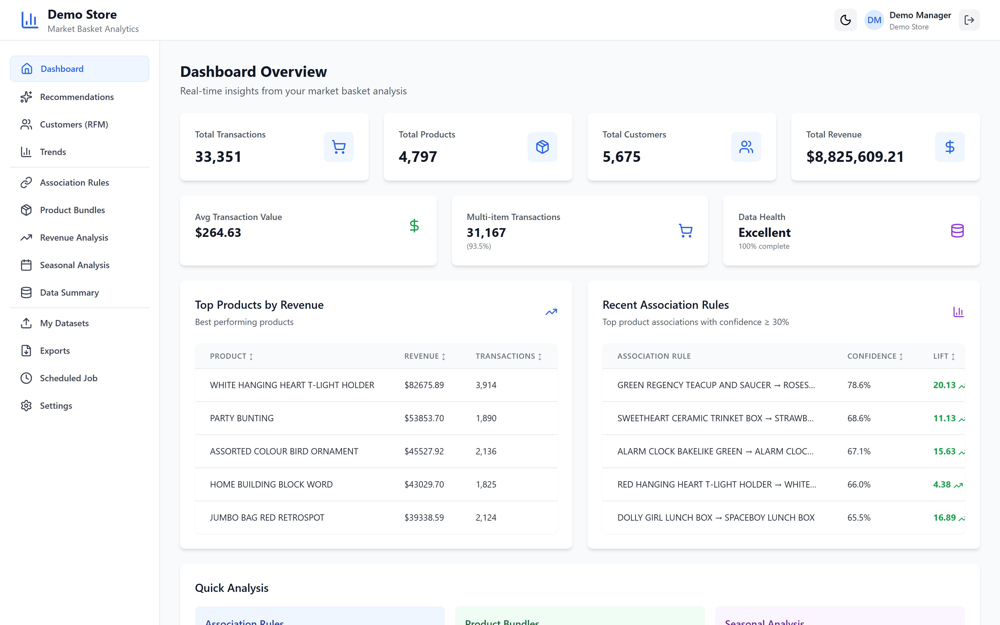

# Assortment Dashboard

> Multi-tenant Market Basket Analytics SaaS — turn raw retail transactions into association rules, product bundles, and revenue insights.


**Assortment Dashboard** is a multi-tenant, SaaS-style data-science platform that runs **Market Basket Analysis** on retail transaction data. Store managers upload their CSV/Excel transaction files and instantly explore association rules (Apriori), recommended product bundles, an interactive product-relationship network graph, revenue and seasonal trends, and RFM-based customer segments — all scoped to their own isolated store. A super admin provisions stores, manages manager accounts, and reviews a full audit trail. The backend is a FastAPI service powered by pandas + mlxtend for the ML/analytics layer and ReportLab for PDF report exports.

<p align="center">
  
</p>

## ✨ Features

- **Market Basket Analysis (Apriori)** — frequent itemset mining and association rules via `mlxtend`, with user-tunable `min_support`, `min_confidence`, and `min_lift` thresholds.
- **Product bundles** — recommended cross-sell bundles derived from association-rule mining, filterable by the same MBA thresholds.
- **Product-relationship network graph** — an interactive force-directed graph (`react-force-graph-2d`) built from frequent itemsets showing how products co-occur.
- **Product recommendations** — "customers who bought X also bought…" suggestions based on co-occurrence, with a configurable minimum co-occurrence count.
- **Revenue & top-product analysis** — revenue breakdowns by country and year, and top products ranked by revenue or quantity.
- **Seasonal analysis** — seasonal, monthly, and per-product demand trends over time.
- **RFM customer segments** — Recency / Frequency / Monetary segmentation of customers.
- **Advanced insights** — cohort retention analysis, period-over-period comparison, and a bundle discount simulator.
- **CSV / Excel upload** — drag-and-drop dataset ingestion (`react-dropzone`) with automatic column mapping; multiple datasets per store with activate / delete management.
- **PDF & CSV exports** — generate downloadable PDF reports (ReportLab) and CSV exports of analytics results.
- **Multi-tenancy & isolation** — every store's data is stored and every analytics endpoint is scoped to the authenticated user's store.
- **Role-based access** — `super_admin` (provision stores, manage managers, view audit logs, platform stats) and `store_manager` (own store, data, analytics, settings).
- **JWT authentication** — access/refresh tokens (`python-jose`) with bcrypt password hashing, login lockout, and password reset flows.
- **Scheduled re-analysis** — APScheduler-driven background jobs with optional email summaries (SMTP).
- **Audit logging** — logins, store/account changes, uploads, exports, and job runs are recorded.
- **Server-side caching** — analytics results are cached per store/dataset/query for fast repeat loads.
- **Theming** — per-store brand color and light/dark theme.

## 🛠️ Tech Stack

**Backend**
- FastAPI + Uvicorn (ASGI)
- SQLAlchemy 2.0 ORM (PostgreSQL or SQLite via `DATABASE_URL`)
- pandas + numpy + mlxtend (Apriori / association rules), pyarrow (Parquet)
- python-jose (JWT) + bcrypt (password hashing)
- ReportLab (PDF), openpyxl (Excel), matplotlib
- APScheduler (background jobs), Jinja2 (email templates)

**Frontend**
- React 19 + Vite 7
- Tailwind CSS 3
- React Router 7
- Recharts (charts) + react-force-graph-2d (network graph)
- axios, react-dropzone, react-hot-toast, lucide-react, @headlessui/react, date-fns

## 🚀 Getting Started

### Prerequisites

- **Python 3.10+**
- **Node.js 18+** and npm
- **PostgreSQL** (optional — the app falls back to a local SQLite file if `DATABASE_URL` is not set)

### Installation

```bash
# clone
git clone <your-repo-url>
cd Assortment-Dashboard

# --- backend ---
cd backend
python -m venv venv
venv\Scripts\activate          # Windows;  on *nix: source venv/bin/activate
pip install -r requirements.txt
copy .env.example .env         # then edit values (see below)

# --- frontend ---
cd ../frontend
npm install
```

### Environment variables

Backend (`backend/.env`) — copy from `backend/.env.example` and edit. Never commit real secrets.

| Key | Description |
|---|---|
| `FLASK_ENV` | `development` or `production` (selects the config profile) |
| `FLASK_DEBUG` | Enable auto-reload / debug mode |
| `SECRET_KEY` | App secret |
| `JWT_SECRET_KEY` | Secret used to sign JWTs (defaults to `SECRET_KEY`) |
| `JWT_ACCESS_TOKEN_EXPIRES` | Access token lifetime in seconds (default `900`) |
| `JWT_REFRESH_TOKEN_EXPIRES` | Refresh token lifetime in seconds (default `604800`) |
| `DATABASE_URL` | DB connection string — PostgreSQL, or omit to use bundled SQLite |
| `MAIL_SERVER` / `MAIL_PORT` | SMTP host and port |
| `MAIL_USE_TLS` / `MAIL_USE_SSL` | SMTP transport security |
| `MAIL_USERNAME` / `MAIL_PASSWORD` | SMTP credentials |
| `MAIL_DEFAULT_SENDER` | Default "from" address |
| `MAIL_SUPPRESS_SEND` | If `true`, emails are not actually sent |
| `SUPER_ADMIN_EMAIL` | Bootstrap super-admin email (created on startup) |
| `SUPER_ADMIN_PASSWORD` | Bootstrap super-admin password |
| `SUPER_ADMIN_NAME` | Bootstrap super-admin display name |
| `FRONTEND_URL` | Frontend base URL (used in emails) |
| `ALLOWED_ORIGINS` | Comma-separated CORS origins |
| `MAX_UPLOAD_MB` | Max upload size in MB (default `50`) |
| `MAX_ROWS_PER_DATASET` | Row cap per dataset (default `1000000`) |
| `PASSWORD_RESET_TTL_MINUTES` | Password-reset token lifetime |
| `LOGIN_LOCKOUT_THRESHOLD` | Failed logins before lockout (default `5`) |
| `LOGIN_LOCKOUT_MINUTES` | Lockout duration in minutes (default `15`) |

Frontend (`frontend/.env`):

| Key | Description |
|---|---|
| `VITE_API_BASE_URL` | API base path (default `/api`, proxied to the backend in dev) |

### Running locally

```bash
# 1) Backend  →  http://localhost:5000   (API docs at /docs)
cd backend
python run.py

# 2) Frontend →  http://localhost:5173
cd frontend
npm run dev
```

On startup the backend creates the database tables and bootstraps the super-admin account from your `.env`. The Vite dev server proxies `/api/*` to `http://localhost:5000`. Sign in as the super admin, provision a store + manager, then log in as the manager to upload data and run analytics.

Frontend production build:

```bash
cd frontend
npm run build
npm run preview
```

## 📁 Project Structure

```
Assortment-Dashboard/
├── backend/
│   ├── app/
│   │   ├── main.py            # FastAPI app factory + router wiring
│   │   ├── database.py        # SQLAlchemy engine / session / Base
│   │   ├── dependencies.py    # auth & store-scope dependencies
│   │   ├── schemas.py         # Pydantic schemas
│   │   ├── routers/           # auth, admin, store, analytics, health
│   │   ├── services/          # mba, analytics, insights, dataset, auth,
│   │   │                      #   email, audit, export, scheduler, cache
│   │   ├── models/            # User, Store, Dataset, AuditLog, ...
│   │   └── utils/             # column_mapping, datetime_features, filters
│   ├── config.py              # env-driven configuration
│   ├── run.py                 # uvicorn entrypoint (port 5000)
│   ├── requirements.txt
│   └── .env.example
├── frontend/
│   ├── src/
│   │   ├── pages/             # Dashboard, AssociationRules, ProductBundles,
│   │   │                      #   NetworkView, RevenueAnalysis, Seasonal…,
│   │   │                      #   admin/*, store/*, auth/*
│   │   ├── components/        # NetworkGraph, DataTable, FilterPanel, ...
│   │   ├── layouts/           # AdminLayout, StoreLayout, AuthLayout
│   │   ├── context/           # AuthContext, ThemeContext
│   │   ├── api/               # axios client + per-domain API modules
│   │   └── App.jsx            # routes
│   ├── vite.config.js
│   └── package.json
└── README.md
```

---

<p align="center">Built by <b>Syed Ibrahim Ali</b> — Full-Stack &amp; AI Engineer</p>
